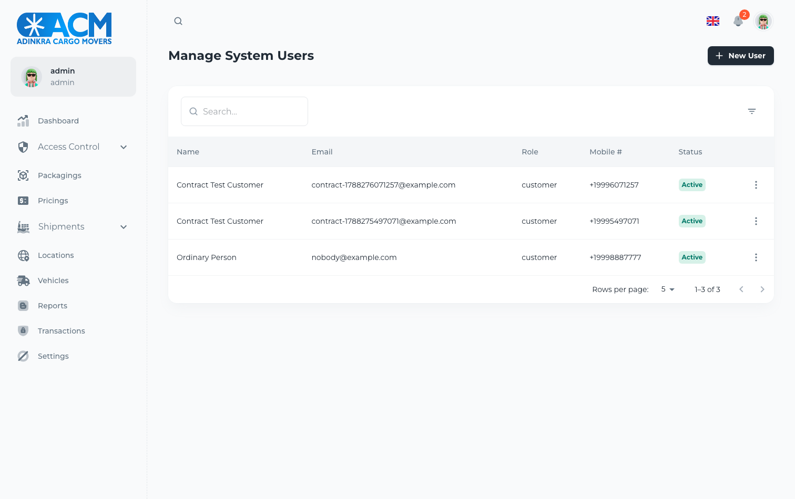

# Adinkra API

The backend for a cargo and logistics platform: orders, parcels, packages,
containers, vehicles, drivers, locations, pricing, and a role-based permission
system on top of all of it. Express, TypeORM, PostgreSQL. About 6,600 lines.

The layering is genuinely good — `routes → controllers → dal → entities`, with
Zod schemas validating input at the edge and a seeding setup for reference data.
That structure is why the problems below stood out: the parts were all there.

## Running it

```bash
docker compose up -d --build
docker compose --profile tools run --rm seed     # roles, permissions, admin
npm run test:api                                 # 19 tests
```

The API comes up on `:3006`. The seeded administrator is
`admin@example.com` / `Helloworld`.

## What was wrong

### A customer could delete the administrator

There is a role system: five roles, a permission table, a seeder, and an
`authenticateRole` middleware written to enforce it. The middleware was never
applied. This was the one line standing between the two:

```js
// import { authenticateRole } from '../middlewares/authenticateRoleMiddleware';
```

Every route had `authenticateJWT`, so you had to be *logged in*. Nothing checked
who you were after that. Signup is public and self-service.

Signing up as an ordinary customer and running one request:

```
DELETE /api/users/<the administrator's id>     →  200 OK
```

The row was gone, and the administrator could no longer sign in.

That is now:

| as a self-registered customer | before | after |
|---|---|---|
| `GET /users` — list everyone | 200 | **403** |
| `GET /user-roles` | 200 | **403** |
| `GET /permissions` | 200 | **403** |
| `GET /users/{someone else}` | 200 | **403** |
| `DELETE /users/{the admin}` | **200** | **403** |
| `GET /users/{yourself}` | 200 | 200 |

Enforcing it needed a second fix. `authenticateRole` reads
`currentUser.user_role.name`, but the JWT middleware's query never loaded the
`user_role` relation — so switching the middleware on would have crashed every
request on `undefined.name`. The relation is loaded now, and the check denies
rather than throws when it is missing.



### Tokens never expired

```js
sign({ id: JSON.stringify(user) }, secret)   // no expiresIn
```

No `exp` claim, so every token ever issued is valid forever. A token copied out
of a log or a browser stayed a working credential permanently, and changing the
account's password did nothing to it. Access tokens now last 15 minutes, refresh
tokens a day, matching the cookie that was already being set with a one-day
`maxAge`.

### Password hashes were served to anyone logged in

`GET /api/users` returned the full row, `password` and `refresh_token` included,
to any authenticated caller. Marking both columns `select: false` keeps them out
of every query that does not name them explicitly — the two login lookups do, so
they still work.

### The API reported itself healthy with no database

```js
} catch (err) {
  console.log(`ERROR: Couldn't connect to database ${err}`);
}
```

The connection failure was caught, logged, and swallowed, and the process went
on to listen on `:3006`. To anything checking whether the service was up, it was
up; every request that touched data failed. It now refuses to start.

Underneath that, `createDatabase()` was called with no arguments, so it could
not find the connection details at all.

### The container could never have started

```dockerfile
RUN npm install
COPY . .
CMD [ "npm", "start" ]      # -> node build/src/server.js
```

Nothing ever ran `npm run build`, so `build/` did not exist in the image. The
container exited immediately with a module-not-found error. It is a two-stage
build now, on Node 20 rather than Node 16, which went end-of-life in 2023.

### Two settings that contradicted their own config

`synchronize: true` was set for **production**. TypeORM rewrites the live schema
to match the entities on every boot when that is on, which can drop columns.

`FRONT_END_DOMAIN` was in `.env.example` and loaded into `appConfig`, and read
by nothing — the app called `cors()` with no arguments, allowing every origin
while a login route hands out an httpOnly cookie. CORS now uses that setting.

```
Origin: http://localhost:3010   →  Access-Control-Allow-Origin: http://localhost:3010
Origin: http://evil.example     →  (no header)
```

### A malformed token hung the request

`JSON.parse(decoded.id)` ran inside an async callback with no error handling. A
token whose payload was not the JSON the middleware expected produced an
unhandled rejection, and the request hung instead of being refused. It returns
403 now, and there is a test for it.

## Tests

19 contract tests, run against the running stack. There were none before.

```
✓ tokens                     2   expiry present; no hash in the payload
✓ unauthenticated requests   7   401 without a token, 403 for malformed ones
✓ a self-registered customer 6   refused every admin surface; keeps its own record
✓ an administrator           4   reaches them; is not served hashes

19 passed
```

Each one corresponds to something the API actually allowed.

## Layout

```
src/
  routes/        one router per resource, and where authorization is applied
  controllers/   request handling
  dal/           data access
  entities/      TypeORM models
  schemas/       Zod validation
  middlewares/   authenticateJWT, authenticateRole, validate
  seeding/       roles, permissions, countries, cities, an admin user
tests/           authorization contract tests
```
